# TeachNook Cloud Computing Internship – Chatbot Project

## Internship Overview
This project was developed as part of my **2-month Cloud Computing Internship at TeachNook**.  
During the internship, I learned how to build chatbots using **Amazon Lex**, integrate them with backend services, design conversational flows, and understand cloud-based application development.

---

# Hotel Booking Chatbot using Amazon Lex

## Project Objective
The goal of this capstone project was to **create a Hotel Booking Chatbot** using **Amazon Lex** with the following requirements:

1. The chatbot must collect all hotel booking details from the user.  
2. It must allow users to choose room types such as **Classic, Duplex, Double Bed**, etc.  
3. It must give a **final booking summary**, including:  
   - Room type  
   - Price  
   - Duration of stay  
   - Location  
4. The entire conversation must flow smoothly under the **BookHotel intent**.

---

## Features Implemented
- Intent-based design using Amazon Lex (`BookHotel`)
- Slot filling for inputs such as:
  - **City**
  - **Number of days**
  - **Room type**
  - **Price range**
- Fulfillment messages to confirm bookings
- Error handling and re-prompt messages
- Natural language conversation-style chatbot

---

## Technologies Used
- **Amazon Lex** – for building the chatbot  
- **AWS Lambda** – for backend logic  
- **AWS IAM** – for permissions  
- **Python** – for Lambda functions  
- **AWS CloudWatch** – for monitoring logs  

---

## Sample Conversation Flow

**User:** Book a room in Goa for 3 days under ₹1000  
**Bot:** What type of room would you like? Classic, Duplex, or Double Bed?  
**User:** Duplex  
**Bot:** Can I go ahead and confirm your booking?  
**User:** Yes  
**Bot:** Your booking is confirmed! Duration: 3 days, Price: ₹1000, Room: Duplex. Thank you!  

---

## Screenshots

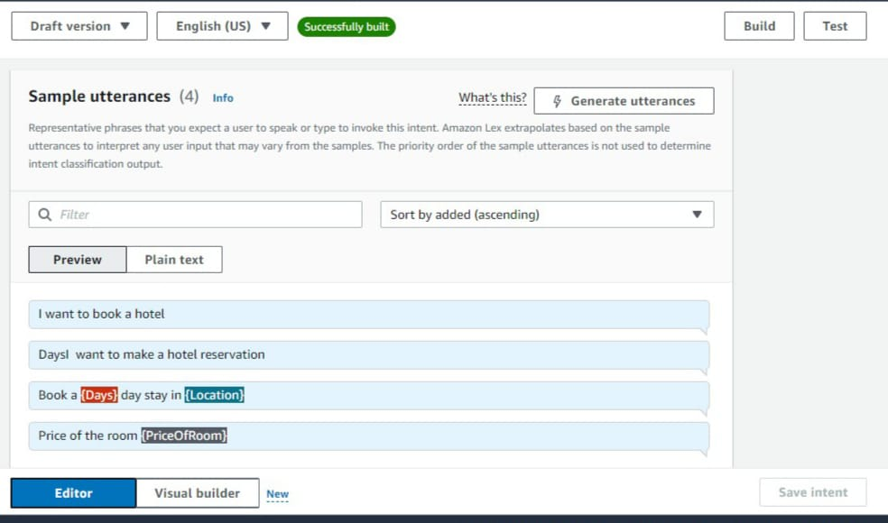
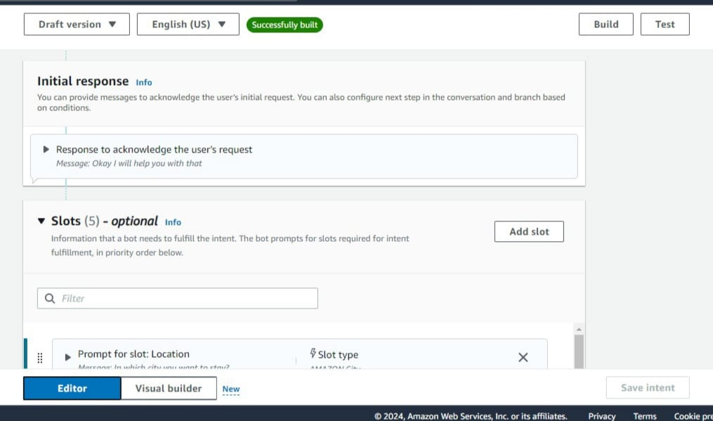
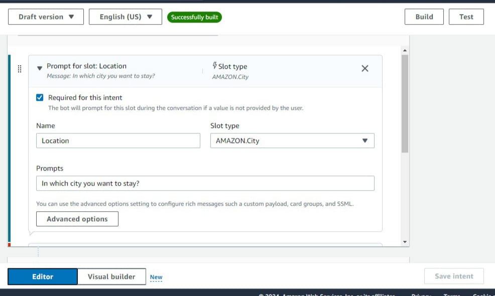

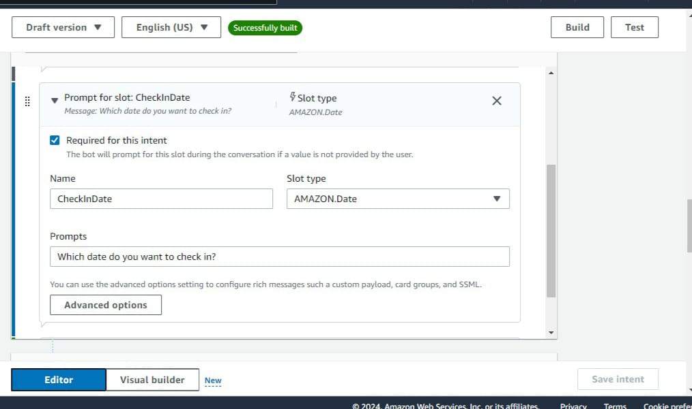
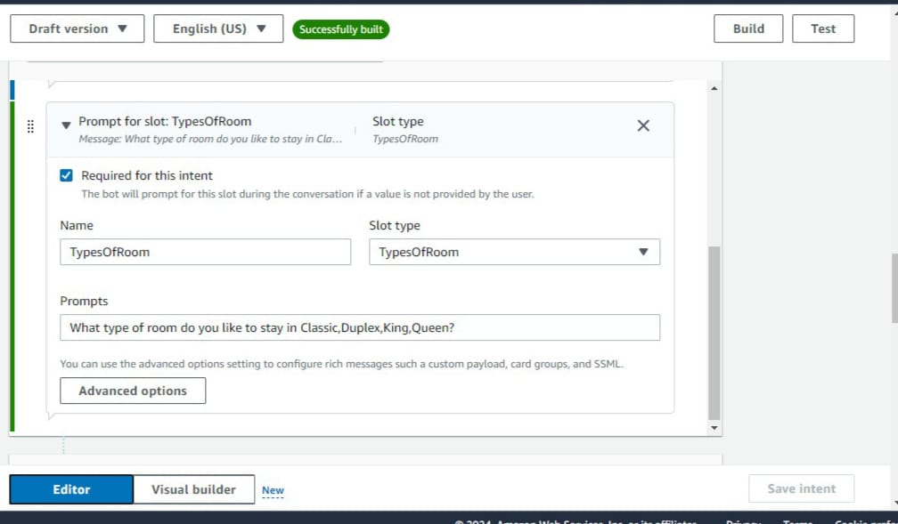
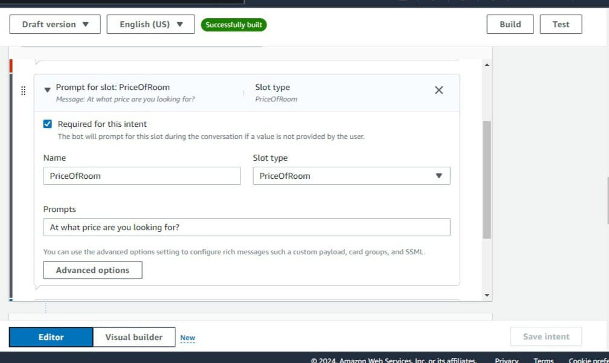
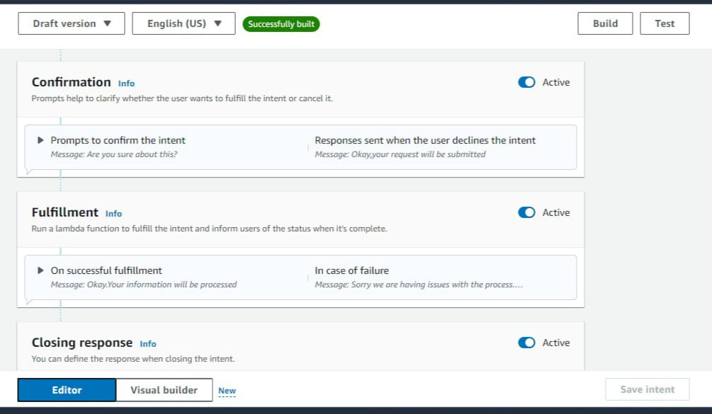
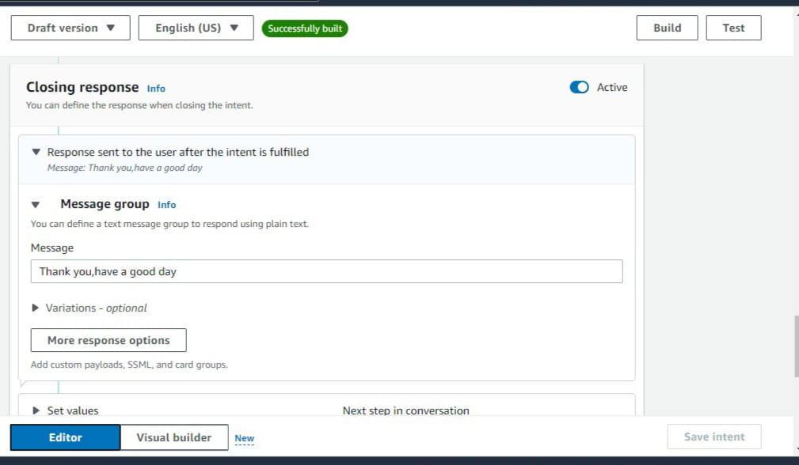
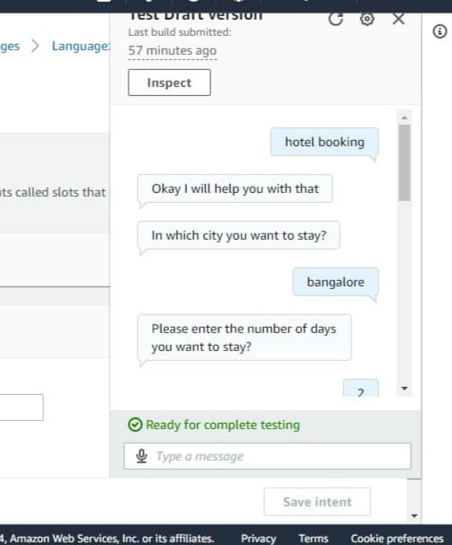
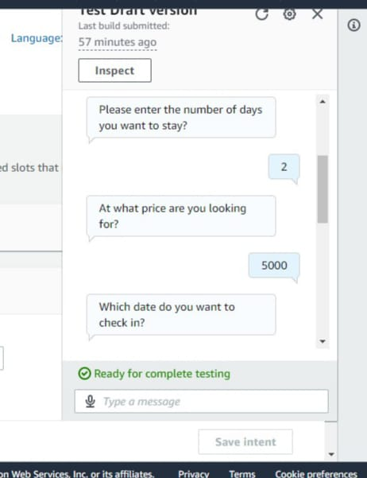
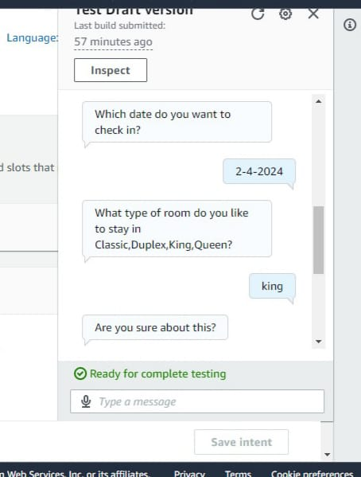
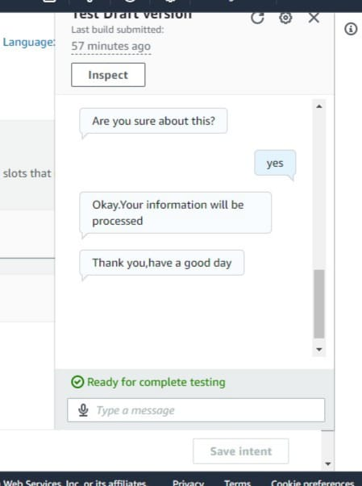

---

## What I Learned During the Internship
- Building and configuring chatbots in Amazon Lex  
- Creating intents, slots, and slot types  
- Writing and connecting AWS Lambda functions  
- Designing end-to-end chatbot user flows  
- Debugging and monitoring using CloudWatch  
- Basics of cloud deployment  

---

## Project Structure
