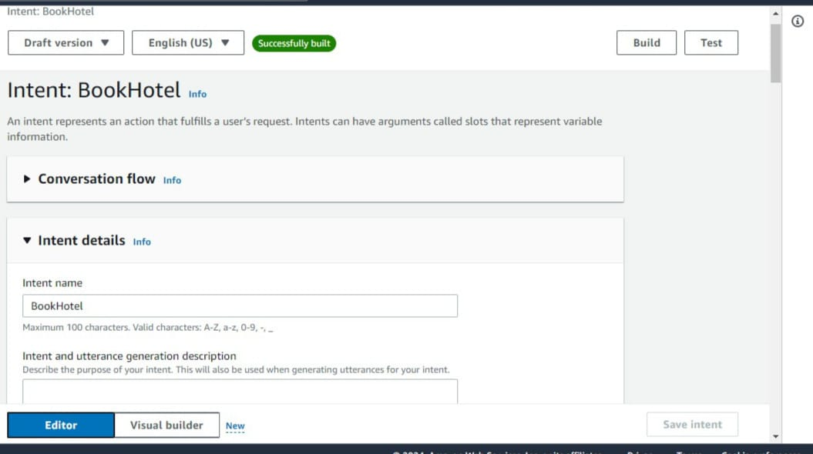
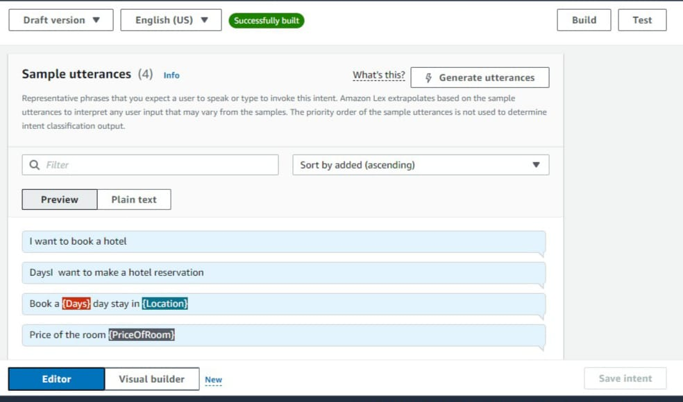
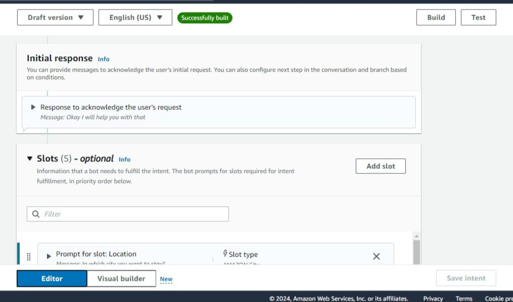
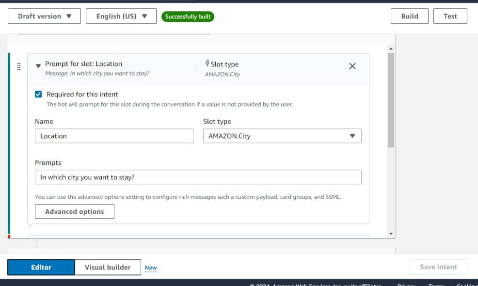
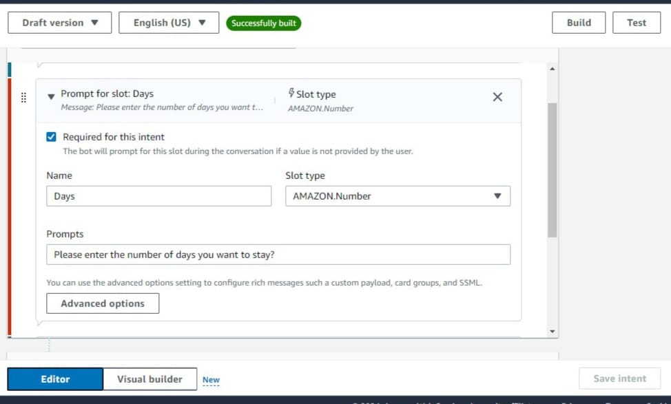
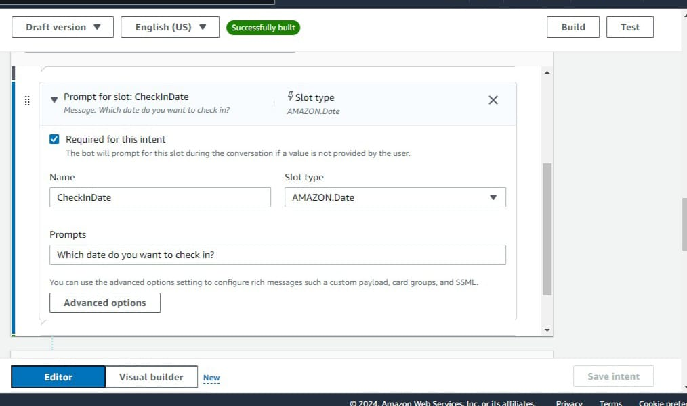

# TeachNook Cloud Computing Internship(Chatbot Project)

## Internship Overview

This project was developed as part of my **2-month Cloud Computing Internship at TeachNook**.
During the internship, I learned how to build chatbots using **Amazon Lex**, integrate them with backend services, design conversational flows, and understand cloud-based application development.

---

# Hotel Booking Chatbot using Amazon Lex

## Project Objective

The goal of this capstone project was to **create a Hotel Booking Chatbot** using **Amazon Lex** with the following requirements:

1. The chatbot must collect all hotel booking details from the user.
2. It must allow users to choose room types such as **Classic, Duplex, Double Bed**, etc.
3. It must give a **final booking summary**, including:
   * Room type
   * Price
   * Duration of stay
   * Location
4. The entire conversation must flow smoothly under the **BookHotel intent**.

---

## Features Implemented

* Intent based design using Amazon Lex (BookHotel)
* Slot filling for inputs such as:
  * **City**
  * **Number of days**
  * **Room type**
  * **Price range**
* Fulfillment messages to confirm bookings
* Error handling and re-prompt messages
* Natural language conversation-style chatbot

---

## Technologies Used

* **Amazon Lex** – for building the chatbot
* **AWS Lambda** – for backend logic
* **AWS IAM** – for permissions
* **Python** – for Lambda functions
* **AWS CloudWatch** – for monitoring logs

---

## System Workflow

1. User starts a hotel booking conversation.
2. Amazon Lex identifies the **BookHotel** intent.
3. The chatbot collects booking information through slots.
4. AWS Lambda processes the collected inputs.
5. Booking details are validated.
6. A booking summary is generated.
7. Confirmation is displayed to the user.

---

### Conversation Flow

The chatbot flowchart is available here: [`chatbot_flowchart.png`](./assets/chatbot_flowchart.png)

---

## Example Interaction

You can view a sample conversation with the chatbot in the example interaction: [example.txt](assets/example.txt)

---

## Project Structure

```text
hotel-booking-chatbot

├── README.md
├── screenshots/
├── assets/
│   ├── chatbot_flowchart.png
│   └── example.txt
```

---

## Screenshots

Below are the initial preview screenshots.
Additional implementation screenshots are available in the [`/screenshots`](./screenshots) folder.

<p align="center">
  
  
  
</p>

<p align="center">
  
  
  
</p>

---

## What I Learned During the Internship

* Building and configuring chatbots in Amazon Lex
* Creating intents, slots, and slot types
* Writing and connecting AWS Lambda functions
* Designing end-to-end chatbot user flows
* Debugging and monitoring using CloudWatch
* Basics of cloud deployment

---

## Conclusion

This project provided hands-on experience in developing cloud-based conversational applications using Amazon Lex and AWS services. It strengthened my understanding of chatbot design, intent handling, slot filling, AWS Lambda integration, and cloud computing fundamentals.
